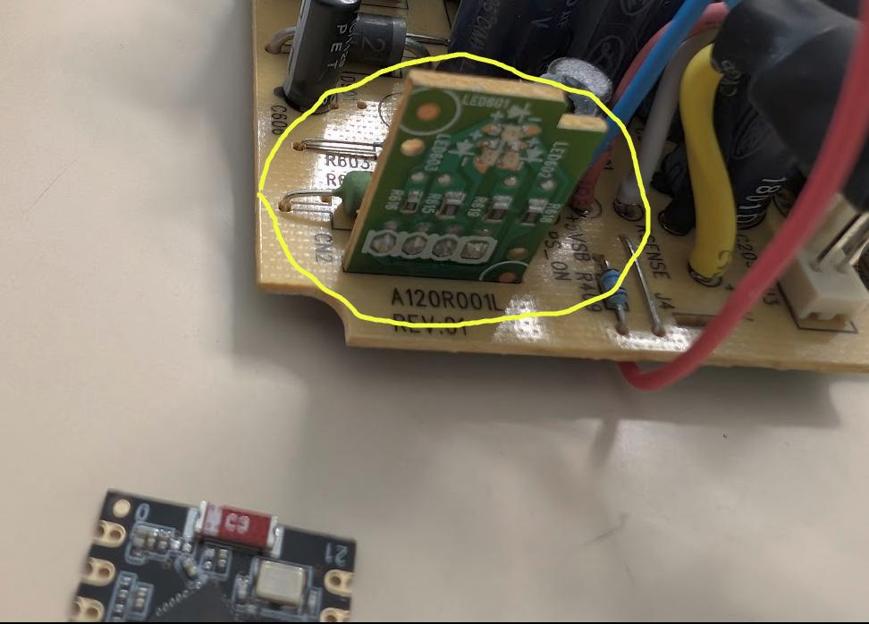
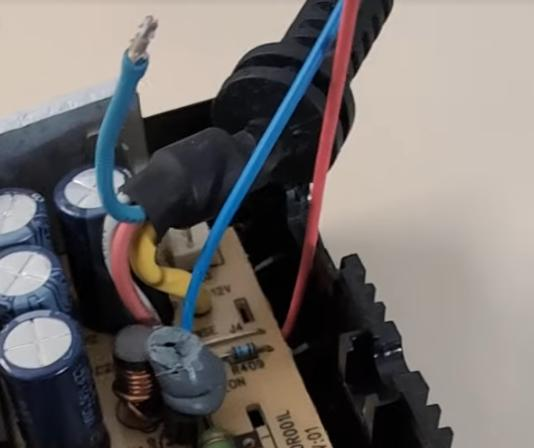
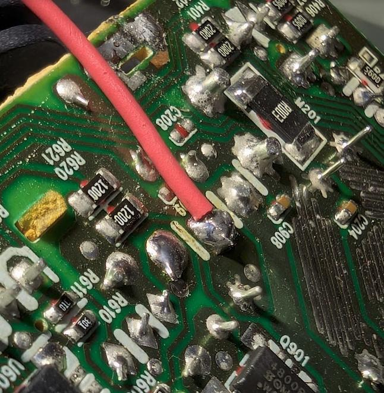
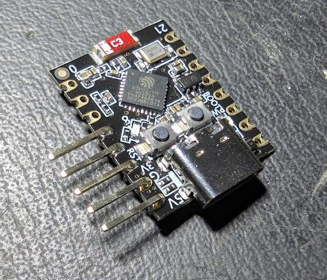
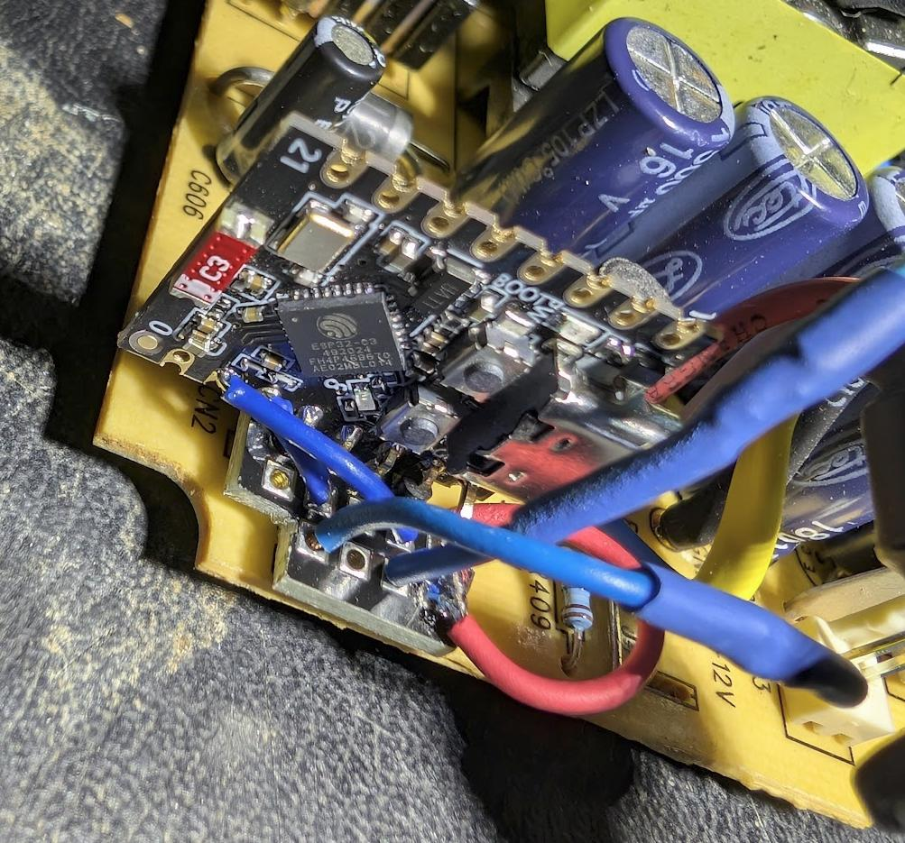
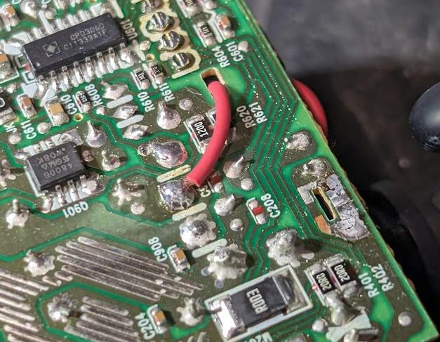
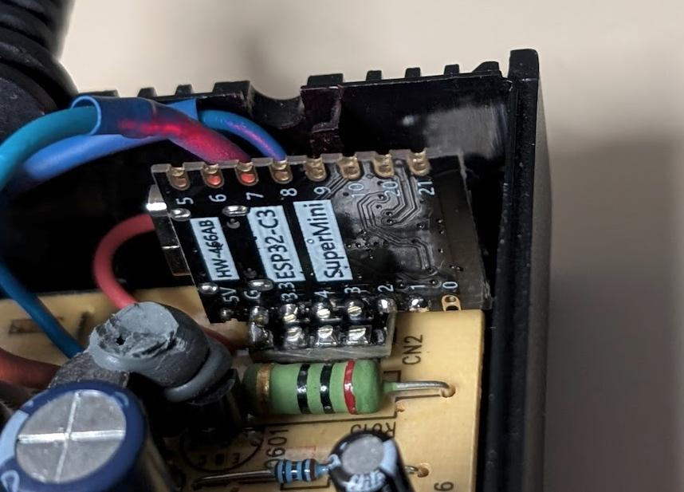
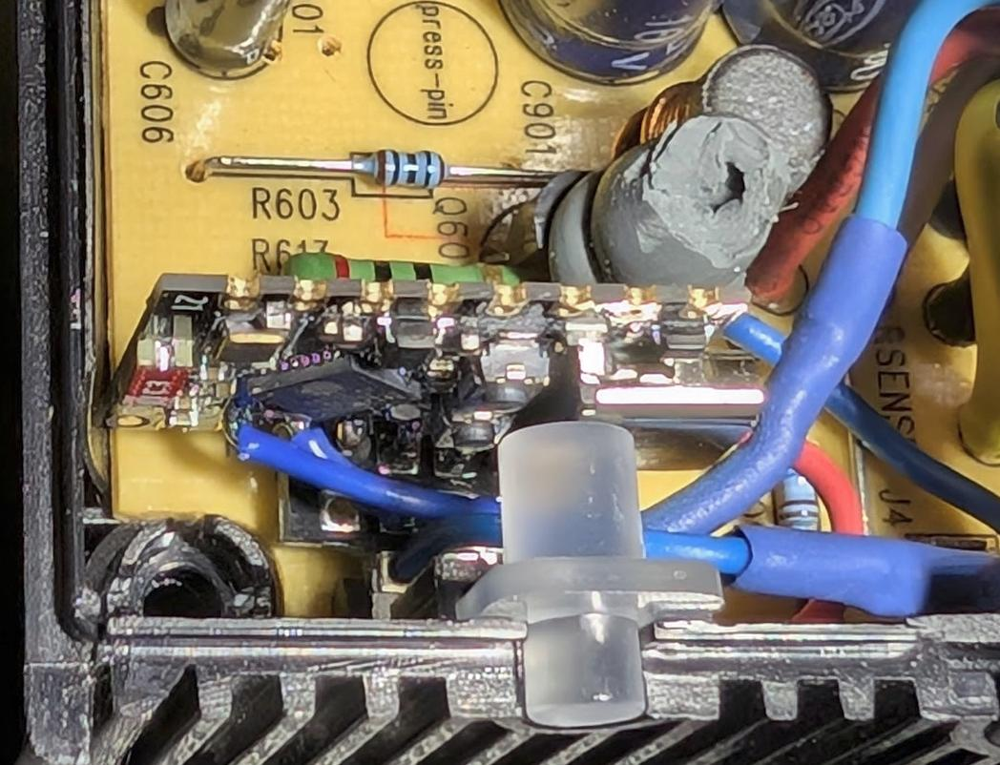

# xbox-kill-switch

## Intro

This Arduino sketch implements a kill switch for disabling the Xbox360. 
It can be used as part of a parental control strategy for disabling 
the xbox during unsuitable times (e.g. 06:00am before school!).

Instead of disabling the xbox itself, it's easiest to disable the PSU.
The PSU supplies 5v standby to the console at all times, which allows
powering up of the PSU from the console itself.  The console sends a 
3.3v signal on the blue cable to the PSU IC, and this switches on the
12v rail, required for playing games.  If the blue cable is interrupted
the xbox powers down.  So all that's required is something that prevents
the blue signal getting from the xbox to the PSU.  The just needs 3.3v
GPIO input (from the xbox) and output (to the PSU).  The ESP decides when
the signal will be allowed through.

## Hardware Requirements

- ESP32-C3 Miniboard
- Some flexible cable
- Right-angle SIL 0.1 pitch header
- Small amount of Perf board

For this project I've used a ESP32-C3 miniboard.  
https://forum.arduino.cc/t/esp32-c3-supermini-pinout/1189850

You could in theory use a ESP-01S however you need two pins that
are completely under your control, and the ESP-01S has various issues
with many of the pins that could give problems, e.g. they must be at
certain levels during boot, or they spew momentary noise before you
can take control of them.  Also the ESP-01S requires an external 
5v->3.3v regulator, and this is included on the C3 miniboard.

## Software

The software connects to my wifi and queries a UDP server to see 
whether it should be enabled or disabled.  To control the kill
switch manually you can use a combination of:

This web interface:
https://github.com/bifferos/switchboard-web-ui

And this UDP server:
https://github.com/bifferos/switchboard-udp

But so long as you are OK with creating/deleting a file to 
enable/disable the xbox then you can just use the UDP server.

## Building

### Step 1

Remove the LED board, we'll put the ESP there.

### Step 2

Desolder the blue cable, we need to break into it.  Add another
cable from the PSU PCB 

### Step 3

Add a power cable, the only place you can get 5v is to solder 
directly onto the outgoing 5v supply, unless you break into the
5v cable by removing it, then tee off it.

### Step 4

Put a right-angle header on.  note that only the right-hand pins are used (for power/gnd).  The other pins are only there for support.

### Step 5

Header into perfboard, and then into the PCB.  The perfboard is there to accept the cables.  I introduced an intermediate board, because
the ESP32-C3 miniboard is incredibly thin, thinner than the ESP-01S even.  I didn't want free cables that can move around inside the PSU to connect direct to the ESP32-C3.
So the ESP site on the PERF board, and only connects to it.  This gives the whole thing a lot more strength.

### Step 6

Power can go through the hole vacated by the original LED board edge (it sticks through the hole).

